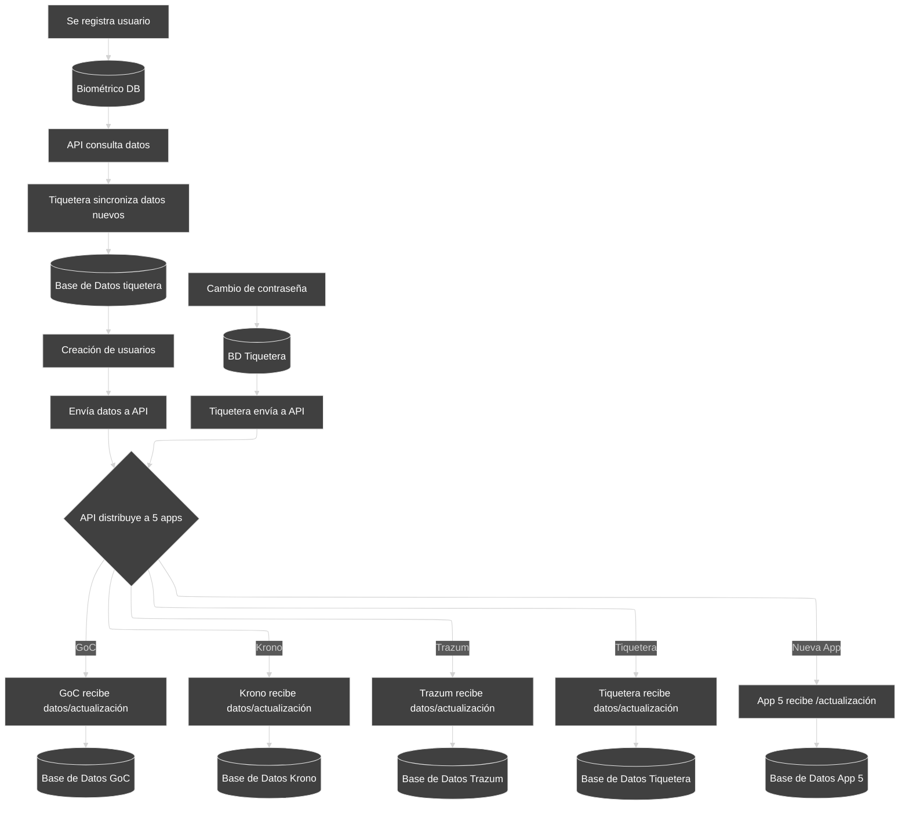

```mermaid
---
config:
  layout: elk
  theme: dark
---
flowchart TD
    A[Se registra usuario] --> B[(Biométrico DB)]
    B --> C[API consulta datos]
    C --> D[Tiquetera sincroniza datos nuevos]
    D --> E[(Base de Datos tiquetera)]
    E --> F[Creación de usuarios]
    F --> G[Envía datos a API]
    G --> H{API distribuye a 5 apps}
    
    N[Cambio de contraseña] --> O[(BD Tiquetera)]
    O --> P[Tiquetera envía a API]
    P --> H
    
    H -->|GoC| I[GoC recibe datos/actualización]
    H -->|Krono| J[Krono recibe datos/actualización]
    H -->|Trazum| K[Trazum recibe datos/actualización]
    H -->|Tiquetera| L[Tiquetera recibe datos/actualización]
    H -->|Nueva App| W[App 5 recibe /actualización]
    
    I --> DB1[(Base de Datos GoC)]
    J --> DB2[(Base de Datos Krono)]
    K --> DB3[(Base de Datos Trazum)]
    L --> DB4[(Base de Datos Tiquetera)]
    W --> DB5[(Base de Datos App 5)]
    
    classDef default fill:#404040,stroke:#e5e5e5,stroke-width:1px,color:#ffffff
```
